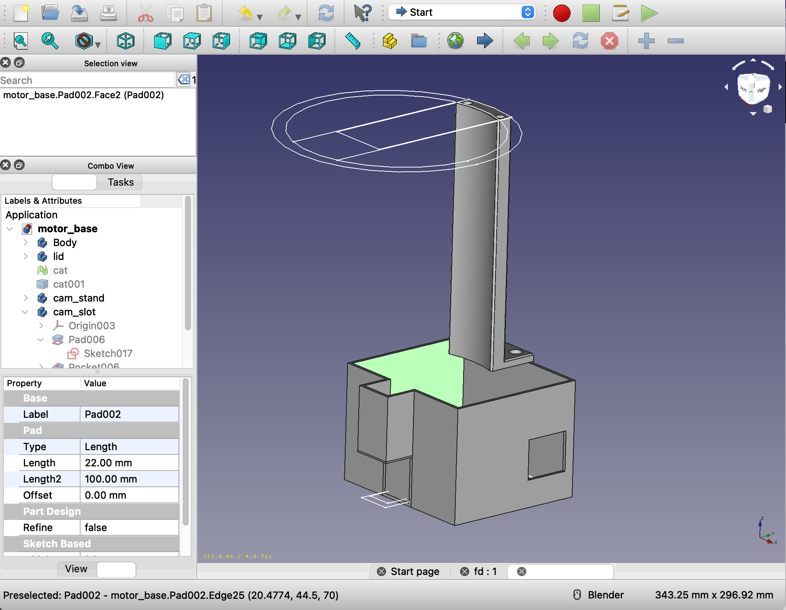
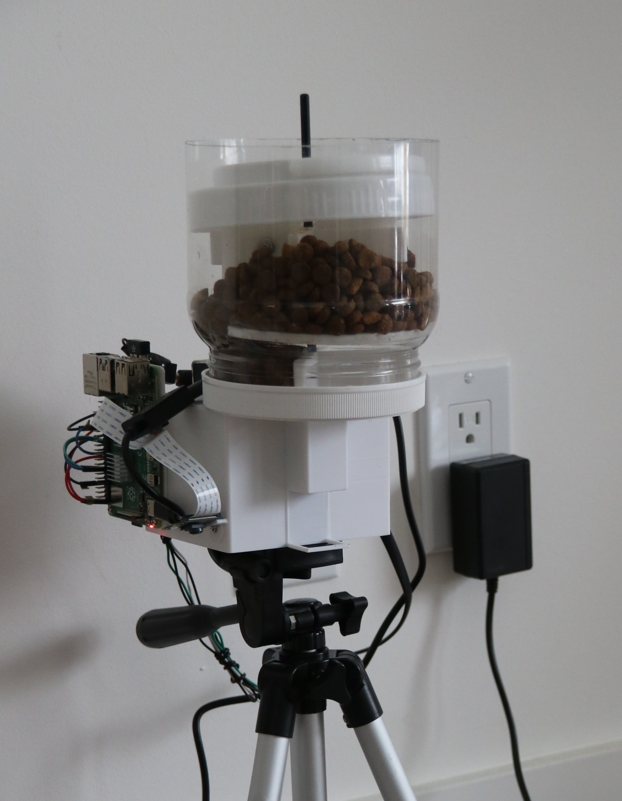
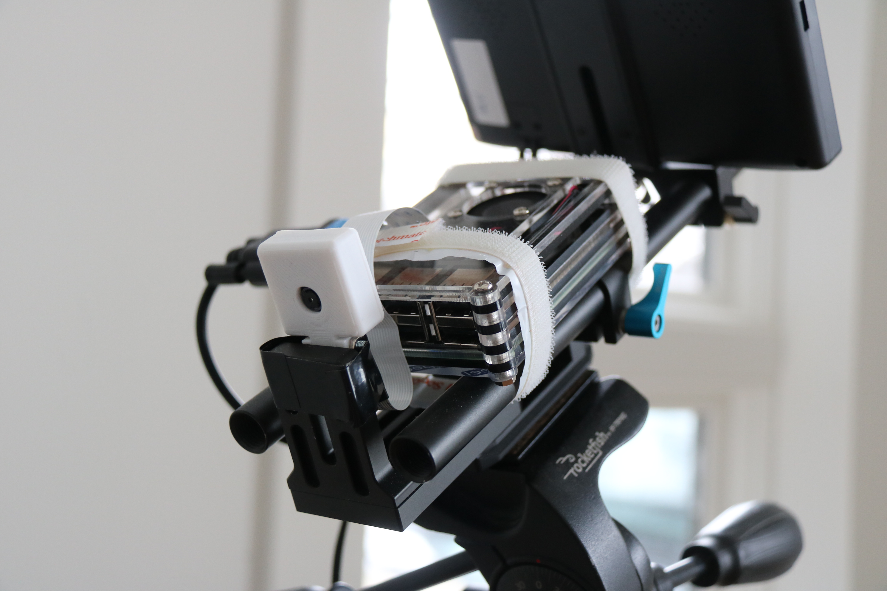

# Say Hi to Mimi


A few months ago, some relatives of mine were travelling abroad and needed a family to take care of their cat for a while. I, having wanted a cat since forever, was glad to take her in.

At the time, I had also recently completed Andrew Ng's popular [machine learning course](https://www.coursera.org/learn/machine-learning), offered by Stanford on Coursera, and was looking for ideas on a project to apply this new knowledge. I was about to settle on the idea of training a neural network to identify if the microwave and refrigerator doors in my kitchen were open (something that practically would just be done using a sensor), until our family brought in Mimi.

Here's how I created bowl-ml, an automated cat food dispenser using convolutional neural networks and IoTs.

## Background

There exists many "smart pet feeders" on the market which come with a plethora of features, such as scheduled feedings, camera monitering, motion sensors, and Wifi compatability along with an app for your smartphone. However, as artificial intelligence is making its way into more and more areas in our lives, the standards for a "smart" product are evolving.

Two main features of smart pet feeders are **pet detection**, which allows the food to only be dispensed when the pet arrives, thus preserving freshness, and **portion management**, in which portions are dispensed at controllable intervals.

Typically, pet detection is done via IR motion sensors, which can detect an approaching pet, and portion management is often done using programmable timers. However, neither of these methods are truly smart. Motion sensors can be activated on accident by humans, or even a vacuum robot, and timers are oblivious to whether or not the bowl is empty.

This is where machine learning comes into play. By using AI to detect the state of the bowl and to detect specifically for approaching pets, automatic pet feeders can become much smarter and more controllable, while also removing the need for potentially expensive extra equipment such as IR sensors.

To demonstrate this, my project uses a custom-trained convolutional neural network to determine whether a bowl is empty or full, and a pre-trained neural network that can accurately recognize the correct animal approaching the feeder. It uses two Raspberry Pis with a PiCamera each, one to monitor the state of the bowl, and another to watch for incoming pets. Communication will be done using a webserver hosted on one Pi, and the dispenser mechanism will be done using a 3D-printed system, with some Lego motors.


# Creating a Bowl Capacity Monitor

## Setting Up My Environment - TensorFlow & Jupyter Notebook

To create this project, I learned to use [Anaconda](https://www.anaconda.com/), a Python environment management software designed for data science. From there, importing packages such as [TensorFlow](https://www.tensorflow.org/), [Keras](https://keras.io/), and [Jupyter Notebook](https://jupyter.org/) become as simple as clicking on them.

## Training a Neural Network

### Collecting the Dataset

In order to train my own neural network, I first needed needed to collect my own dataset of Mimi's food bowl, with properly labelled training and validation sets.

To make collecting the data set easier, I wrote a [script](https://github.com/chitsbits/bowl-ml/blob/master/take_train_images.py) (`take_train_images.py`) that allowed me to take pictures using the spacebar, while also automatically naming the image and uploading it to my home server. I took the pictures with the Raspberry Pi I would later use for the dispenser, and made sure to keep the positioning the same, in order to keep the model accurate.

I collected a total of 129 images; 25 images of a empty bowl, and 104 images of a non-empty bowl. Using the 80/20% rule of thumb, I put 80% of the images, randomly selected, to the training set, and the other 20% to the validation set.


You can view the whole dataset [here](https://github.com/chitsbits/bowl-ml/blob/master/bowl_dataset.zip).

### Creating the Model

Now that I had my images, I could create and train a neural network on the dataset. As we were dealing with image data, a convolutional neural network best suited my needs. I wrote my training program in [ModelTrainer.ipynb](https://github.com/chitsbits/bowl-ml/blob/master/ModelTrainer.ipynb).

First, I needed to load the images and rescale the data to values between 0 - 255, resize them to 300x300 pixels, and convert them to grayscale.

To speed up computation, I specified a batch size of 10, meaning that the model would process 10 images before actually back-propagating and updating the weights.

```python
BATCH_SIZE=10
img_dim = 300

train = ImageDataGenerator(rescale = 1./255)
validation = ImageDataGenerator(rescale = 1./255)
test = ImageDataGenerator(rescale = 1./255)

train_data = train.flow_from_directory(directory="../dataset/cat/train/",
                                        target_size=(img_dim,img_dim),
                                        color_mode = "grayscale",
                                        class_mode = "binary",
                                        batch_size=BATCH_SIZE)

validation_data = validation.flow_from_directory(directory="../dataset/cat/validation/",
                                        target_size=(img_dim,img_dim),
                                        color_mode = "grayscale",
                                        class_mode = "binary",
                                        batch_size=BATCH_SIZE)

train_steps = np.ceil(train_data.samples / BATCH_SIZE)
val_steps = np.ceil(validation_data.samples / BATCH_SIZE)
```

After loading the data, I created my convolutional neural network. You can see my model below, implemented using the Keras API.

```python
model = keras.models.Sequential()
   
model.add(Conv2D(32, kernel_size=(3, 3), activation='relu', input_shape=(img_dim,img_dim,1)))
model.add(MaxPooling2D((2, 2)))
model.add(BatchNormalization())
model.add(Dropout(0.2))

model.add(Conv2D(64, kernel_size=(3, 3), activation='relu', padding='same'))
model.add(MaxPooling2D((2, 2)))
model.add(BatchNormalization())
model.add(Dropout(0.3))

model.add(Conv2D(64, kernel_size=(3, 3), activation='relu', padding='same'))
model.add(MaxPooling2D((2, 2)))
model.add(BatchNormalization())
model.add(Dropout(0.4))

model.add(Conv2D(64, kernel_size=(3, 3), activation='relu', padding='same'))
model.add(MaxPooling2D((2, 2)))
model.add(BatchNormalization())
model.add(Dropout(0.4))

model.add(Conv2D(64, kernel_size=(3, 3), activation='relu', padding='same'))
model.add(MaxPooling2D((2, 2)))
model.add(BatchNormalization())
model.add(Dropout(0.4))

model.add(Flatten())
model.add(Dense(128,activation='relu'))
model.add(Dropout(0.5))
model.add(Dense(1,activation='sigmoid'))
model.summary()

model.compile(loss='binary_crossentropy',
            optimizer='adam',
            metrics=['accuracy'])
```

Convolutional Neural Networks perform well on computer vision applications due their ability to learn high-level abstract features in an image, such as lines, shapes, colour, and eventually entire objects. The layers in a ConvNet that enable this ability are  Convolution layers. 

### Convolution Layers

```python
 model.add(Conv2D(32, kernel_size=(3, 3), activation='relu', input_shape=(img_dim,img_dim,1)))
 ```

A convolution operation, much like in a traditional neural network, performs multiplication between the input values and an array of weights. In this case, the weights are referred to as *filters* or *kernels*. Traditionally, these weights would be hand-made, to detect specific shapes from the input. For example, here is a 3x3 kernel:

```
0 0 0
1 1 1
0 0 0
```

When a section of the input is multiplied by this kernel, the pixels along the center horizontal line will be positively activated, whereas the other pixels will be negatively activated, resulting in an output, or *feature map* consisting only of horizontal lines.

Typically, the size of these filters are much smaller than the original image, as this allows the filter to be applied multiple times to different areas of the image, in a process known as *striding*. This allows the output of the layer to be a feature map of every location on the image that contains a horizontal line.

ConvNets become more useful with the stacking of convolution layers; as more convolutions are processed on the outputs of other convolutions, the neural network can begin to extract high-level features, when lines combine to form a shape, or when colours combine to form a gradient.

The greatest power, however, comes from the fact that the weights of these filters can be learned by the machine learning algorithm. That is, the model can learn which features it needs to look out for in order to identify, say, a cat versus a dog.

### Pooling Layers

```python
model.add(MaxPooling2D((2, 2)))
```

Pooling layers are typically added following convolution layers, which reduces computation times by reducing the dimensions of the data. Similar to convolution layers, a small filter is swept throughout the input, and either the maximum or average value of the data within that filter is mapped to the output. This process eliminates "noise" in your data, by further abstracting the input, while retaining the "important" information.

Different types of pooling can be used: max, sum and average, which take the maximum, sum, and average values of the data within the filter, respectively. However, max pooling typically performs the best as it extracts the dominant value, and in my model, max pooling layers with kernel sizes of 2x2 are used.

### Batch Normalization

```python
model.add(BatchNormalization())
```

Batch normalization is also typically used in ConvNets to improve computation time, by reducing *covariance shift*, which is when slight differences between inputs become large differences, due to the way neural networks feed-forward their updated weights.

Covariance shift is reduced by normalizing the outputs of a layer, using the mean and standard deviation of the current batch.


### Dropout
```python
model.add(Dropout(0.2))
```

Dropout layers are used to reduce overfitting in neural networks, by ignoring a certain amount of nodes at certain places in the network. This reduces the amount of co-dependency, as each single neuron has less impact on the overall model.

### Dense layer and Output

```python
model.add(Flatten())
model.add(Dense(128,activation='relu'))
model.add(Dropout(0.5))
model.add(Dense(1,activation='sigmoid'))
```
Finally, the high-level feature ouputs from the previous layers is fed into a standard dense layer of nodes with some dropout, then fed into the output layer, in which a softmax function (in our case, the Sigmoid function) converts the output into a confidence value. Since our model is dealing with binary classification, a confidence of 1 would mean 100% certainty that the bowl is not empty, and a confidence of 0 would mean 100% certainty that the bowl is empty.

## Fitting the Model

```python
# Callbacks
mcp_save = ModelCheckpoint(checkpoint_dir, save_best_only=True,
                           monitor='val_loss', mode='min', verbose=1)

reduce_lr = ReduceLROnPlateau(monitor='val_loss', factor=0.5,
                              patience=2, verbose=1, min_lr=0.00001)

history = model.fit(x=train_data,
                    epochs=500,
                    batch_size=BATCH_SIZE,
                    steps_per_epoch = train_steps,
                    validation_steps = val_steps,
                    validation_data = validation_data,
                    callbacks=[reduce_lr, mcp_save])
```

Finally, the model is fitted with the dataset I created. Two *callbacks* are used, one which reduces the learning rate upon stagnation in order to arrive at the minimum loss, and one that saves the most accurate models. 

Using *Matplotlib*, I graphed the accuracy and loss over time:


## Testing the Model

After training for 500 epochs, I was able consistently create models with 96% accuracy on the validation set.

Finally, I loaded a couple test images to see its performance on fresh data which was unused during training.

As expected, when the bowl still has food, the confidence approaches 100%, and when the bowl is empty or almost empty, the confidence approaches 0%.


Something interesting I noticed was that although there were no images in the training/validation set that contained Mimi standing over the bowl, the model was still able to effectively predict the test images that did, indicating that the model was able to learn specifically the features of the bowl and food, being able to recognize them even when something is obstructing the view. 

## Creating the Dispenser

[TensorFlow Lite](https://www.tensorflow.org/lite) is a lightweight framework for deploying TensorFlow models onto IoT devices, such as for Android, iOS, and Raspberry Pi. Now that I had my working model, I wrote [`LiteConverter.ipynb`](https://github.com/chitsbits/bowl-ml/blob/master/LiteConverter.ipynb) to convert the model from the *SavedModel* format into a `.tflite` file.

Running in the dispenser's Raspberry Pi is [`CatFeeder.py`](https://github.com/chitsbits/bowl-ml/blob/master/cat_feeder/CatFeeder.py), which hosts a basic HTTP server using [Flask](https://flask.palletsprojects.com/en/1.1.x/). The program waits for POST requests from the cat detector, which contains the current status of the cat detector. If both the cat is in the room and the bowl is empty, a function is called which uses the GPIO pins to power the Lego motor, driving an axle that pushes food through an opening.

The dispenser is mounted on a stand, with a 3D printed chassis, containing a box for the motor and a container for the cat food. I modelled the chassis using [FreeCAD](https://www.freecadweb.org/) and [Cura](https://ultimaker.com/software/ultimaker-cura), and printed it at home with an Anycubic Mega X.

<p align="center">
    
    
    
</p>

# Using a Pre-Trained Cat Detector

Unlike with the food bowl, there are many optimized pre-trained cat detectors that you can find online, trained on large datasets. For my cat detector, I used a starter model from the [TensorFlow Object Detection API](https://github.com/tensorflow/models/tree/master/research/object_detection), specifically the SSD MobileNet V1 model. The pre-trained model comes in the `.tflite` format, so no conversion was needed.

<p align="center">
    
</p>

MobileNet V1 is an SSD model, which stands for *Single Shot Detector*. SSD models can identify multiple objects within an image, while also determining their locations and bounding boxes. I used an SSD for this project, as the majority of pre-trained cat models were trained to identify cats versus dogs, rather than cats versus no cats; I needed a model which could do the latter. By simply ignoring other objects found by the model, I could use the SSD model to only detect for cats within the image. Another benefit of using and SSD is that, if needed, one could change the object to detect. For example, if you had a dog instead (or in addition to a cat), the same model could detect for dogs too.

My program, [CatDetector.py](https://github.com/chitsbits/bowl-ml/blob/master/cat_feeder/CatDetector.py), uses modified code from the TensorFlow Lite [examples repository](https://github.com/tensorflow/examples/blob/master/lite/examples/object_detection/raspberry_pi/detect_picamera.py) to detect specifically for the prescence of a cat, ignoring other objects and bounding boxes, and sends that data via POST request to the webserver hosted on the dispenser.

# Conclusion

This project was a lot of fun to make, and I was able to learn and apply so many new things. I believe that my prototype of an automatic pet feeder is a proof of concept for the use of machine learning in a new era of "smart" home appliances. Features that would previously require numerous different sensors can be reduced to a single computer vision task, with a high degree of customizability.